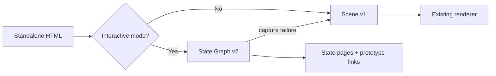

# Interactive State Graph for HTML → Figma

## Status

Approved design; implementation follows only after a separate implementation plan is reviewed.

## Goal

Extend the existing HTML → Figma importer so an optional mode captures a bounded set of meaningful visual states from interactive HTML and renders each state as an editable Figma page with prototype links. The existing static import remains the default path and must keep its current output.

Examples of supported state changes include:

- a listing row opening a detail panel;
- a CTA opening a modal;
- tabs, dropdowns, accordions, and expanded rows;
- tooltip, validation error, empty, loading, or other visible states produced by an interaction.

The result is a visual/prototype snapshot, not a live application or backend integration.

## Compatibility boundary

The importer has two explicit modes:



- v1 remains the default.
- v1 capture, scene schema, renderer, ZIP output, page naming, and current tests remain valid.
- v2 is opt-in through the existing interactive checkbox.
- A v2 discovery failure falls back to the baseline v1 scene. A failed secondary state is skipped without discarding already captured states.
- Figma prototype-link failure must not remove or invalidate generated visual pages.

## State Graph v2 model

The graph is the smallest data structure needed by both the UI and the plugin:

```js
{
  version: 2,
  viewport: { width, height },
  states: [
    {
      id: "state-00",
      label: "Default",
      actionPath: [],
      scene: { version: 1, nodes: [...] }
    },
    {
      id: "state-01",
      label: "Row sản phẩm",
      actionPath: ["row-product-01"],
      scene: { version: 1, nodes: [...] }
    }
  ],
  transitions: [
    {
      from: "state-00",
      to: "state-01",
      actionKey: "row-product-01",
      trigger: "ON_CLICK"
    }
  ]
}
```

Required invariants:

- `state-00` is always the baseline state.
- State IDs, action keys, and transition endpoints are unique within one import.
- `scene` uses the current v1 scene node format; v2 adds only graph metadata.
- Interactive scene nodes that caused a transition carry the same `actionKey` so the renderer can map a transition to a Figma node.
- Duplicate visual states are deduplicated by a stable fingerprint of visible geometry, text, colors, and visibility.

## Discovery

Discovery runs in the browser runtime already used by the importer. A fresh iframe is created for every action path so one state cannot contaminate another.

Candidate actions are collected from the DOM and bounded by cheap, explainable heuristics:

- native `button`, `a`, `summary`, `select`, and form controls;
- elements with button-like roles or `aria-expanded` / `aria-haspopup`;
- rows (`tr`, `role=row`) and elements marked with `data-action` or `data-state`;
- explicit `onclick` handlers;
- visible elements with `cursor: pointer`.

Skip hidden, disabled, external-navigation, and obviously decorative candidates. Each candidate receives a stable `actionKey`, preferring an existing semantic/id/data attribute and falling back to a deterministic DOM-path key.

Exploration is breadth-first, with safe defaults:

```js
{
  maxDepth: 2,
  maxStates: 8,
  maxActionsPerState: 8,
  stateTimeoutMs: 1500,
  settleMs: 80
}
```

The limits are guardrails against combinatorial growth, not an attempt to enumerate every possible application state. A state is captured after the action and a short settle period. Native click behavior is supported; pure CSS `:hover` is best-effort because synthetic browser hover is not equivalent to a real pointer. The first implementation does not add Playwright or a new language/runtime.

## Streaming behavior

The browser sends progress as the graph is explored. Once a state is complete, the Figma bridge renders its page/root and layer batches with event-loop yields, so the user sees progress and pages appearing incrementally rather than waiting for one monolithic render.

The protocol must support these messages without changing v1:

- `state-progress`: state discovery/render progress;
- `import-state`: one completed state plus its scene and metadata;
- `import-finish`: graph metadata and transition list are complete;
- `import-error`: recoverable state-specific error or fatal baseline error.

If the implementation keeps a short capture phase before the first page, it must still stream each completed state during rendering and expose the phase in the UI; it must not claim full streaming before that is implemented.

## Figma output

Each captured state is a separate Figma page, named from the user-selected base name:

```text
Kho hàng · Default
Kho hàng · Row sản phẩm
Kho hàng · Modal tạo giao dịch
```

The page name input continues to default to the imported filename and adds a collision suffix when needed. Each page keeps the current editable scene hierarchy, meaningful layer naming, and current layout/border/overflow behavior.

The renderer keeps mappings for:

- `stateId → page/root frame`;
- `stateId + actionKey → interactive Figma node`.

After destination pages exist, transitions are applied with Figma's async reactions API. Click transitions use `ON_CLICK`, navigate to the destination frame, and use a short dissolve. Hover-capable transitions may use `ON_HOVER` when the discovery result is reliable. If a source node cannot be mapped, the visual pages remain and the transition is reported as skipped.

Use `setReactionsAsync()` for dynamic-page documents; do not write the read-only `reactions` property directly. Reference: [Figma node reactions API](https://developers.figma.com/docs/plugins/api/properties/nodes-reactions/).

## User experience

- Static import remains the simplest default.
- Interactive mode is clearly labeled as bounded exploration, not complete application-state extraction.
- The UI shows current phase, state count, and layer count.
- Page names are editable before import and are used consistently for every generated state page.
- The ZIP includes the baseline scene and graph metadata when interactive mode is used.
- Existing direct-import and ZIP workflows remain available.

## Validation

The implementation is complete only when these checks pass:

- existing v1 unit and bundle tests remain green;
- capture tests cover baseline, panel, modal, tooltip/error/empty candidates, deduplication, depth/state/action limits, and per-state failure recovery;
- renderer tests cover state-page naming, streaming progress, action-key mapping, and reaction fallback;
- generated plugin bundle parses and the package build succeeds;
- direct Figma smoke test verifies at least two editable state pages and one working prototype link;
- a static HTML import produces the same v1 behavior as before the feature.

## Non-goals for this increment

- full graph enumeration or exhaustive state coverage;
- real backend/API execution inside Figma;
- preserving application JavaScript as a runnable Figma app;
- automatic perfect detection of every CSS-only hover state;
- adding a second programming language or browser automation dependency.

The bounded graph is intentionally a best-effort visual/prototype layer. A later increment can add explicit author annotations such as `data-c2figma-action` or a larger exploration budget without changing the v1 scene renderer.
